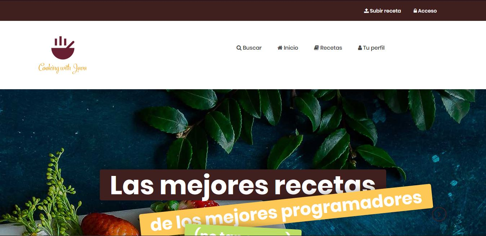

- [CookingWithJava](#cookingwithjava)
  - [EQUIPO](#equipo)
  - [FASE 1 - Equipo de desarrollo y temática de la web](#fase-1---equipo-de-desarrollo-y-tem%C3%A1tica-de-la-web)
    - [Descripción de la temática de la web](#descripci%C3%B3n-de-la-tem%C3%A1tica-de-la-web)
    - [Nombre y descripción de las entidades principales.](#nombre-y-descripci%C3%B3n-de-las-entidades-principales)
    - [Descripción de las funcionalidades del servicio interno](#descripci%C3%B3n-de-las-funcionalidades-del-servicio-interno)
  - [FASE 2 - Desarrollo de la aplicación web en local](#fase-2---desarrollo-de-la-aplicaci%C3%B3n-web-en-local)
    - [Capturas de pantalla y una breve descripción de cada una de las páginas principales](#capturas-de-pantalla-y-una-breve-descripci%C3%B3n-de-cada-una-de-las-p%C3%A1ginas-principales)
    - [Diagrama de navegación de las principales páginas.](#diagrama-de-navegaci%C3%B3n-de-las-principales-p%C3%A1ginas)
    - [Modelo de datos de la aplicación](#modelo-de-datos-de-la-aplicaci%C3%B3n)
      - [Diagrama de clases UML](#diagrama-de-clases-uml)
      - [Diagrama Entidad/Relación que muestre cómo se persisten dichos datos en la base de datos relacional.](#diagrama-entidadrelaci%C3%B3n-que-muestre-c%C3%B3mo-se-persisten-dichos-datos-en-la-base-de-datos-relacional)
  - [FASE 3 - Inclusión de seguridad y servicio interno](#fase-3---inclusi%C3%B3n-de-seguridad-y-servicio-interno)
    - [Instrucciones de despliegue](#instrucciones-de-despliegue)
  - [FASE 4 - Incluir tolerancia a fallos en la aplicación](#fase-4---incluir-tolerancia-a-fallos-en-la-aplicaci%C3%B3n)
  - [FASE 5 - Automatizar el despliegue de la aplicación.](#fase-5---automatizar-el-despliegue-de-la-aplicaci%C3%B3n)

# CookingWithJava
Este proyecto consiste en la práctica final de la asignatura de Desarrollo de Aplicaciones Distribuidas del grado de Ingeniería de Computadores de la URJC. Consistente en realizar una aplicación web de temática libre.

## EQUIPO
Nombre | Apellidos | Grado | Correo | Cuenta de GitHub
-- | -- | -- | -- | --
Iago | Calvo Lista | Videojuegos + Ing. de Computadores | [i.calvol@alumnos.urjc.es](mailto:i.calvol@alumnos.urjc.es) | [iagoCL](https://github.com/iagoCL)
Javier | Mártinez Pablo | Videojuegos + Ing. de Computadores | [j.martinezpa@alumnos.urjc.es](mailto:j.martinezpa@alumnos.urjc.es) | [JaviBJ99](https://github.com/JaviBJ99)
Juan | Jimenez Galvez | Videojuegos + Ing. de Computadores | [j.jimenezgal@alumnos.urjc.es](mailto:j.martinezpa@alumnos.urjc.es) | [Who1ne](https://github.com/Who1ne)

## FASE 1 - Equipo de desarrollo y temática de la web
### Descripción de la temática de la web
Para la temática de la web se ha decidido hacer una web de recetas de cocina, en la que los usuarios podrán ir subiendo sus propias recetas y compartirlas con la comunidad. Permitiendo comentar dichas recetas, marcarlas como favoritas o buscar una receta por distintos campos.

A continuación, se procede hacer un resumen de las principales funcionalidades que se planea soportar en nuestra página web junto a su nivel de acceso:
* **Funcionalidades públicas**: Disponibles a todos los usuarios.
  * **Visitar una receta**: Se podrá visualizar y consultar la receta.
  * **Buscar una receta**: Se podrá consultar en la base de datos las recetas disponibles, pudiéndose realizar búsquedas por plato, nombre, ingredientes, usuario, etc.
  * **Registro o *login***: Que permitirá el acceso a la parte privada.
* **Funcionalidades privadas**: Disponibles solo a los usuarios registrados.
  * **Marcar una receta como favorita**: Se podrá marcar una receta como favorita.
  * **Consultar las recetas favoritas**: Se podrá consultar un listado de todas las recetas marcadas como favoritas.
  * **Crear una nueva receta**: Se podrá crear una nueva receta.
  * **Consultar las recetas creadas**: Se podrá consultar un listado de todas las recetas creadas por el usuario.
  * **Comentar en una receta**: Se podrá comentar en una receta.

### Nombre y descripción de las entidades principales.
Las principales entidades que se planea implementar en nuestra aplicación son:
* **Usuario**: Contiene a un usuario en concreto.
  * **Identificador de usuario**: Identificación interna del usuario. Es usado como identificador y se autogenera. 
  * **Nombre de usuario**: *Nick* público en los comentarios. Es una variable requerida. 
  * **Contraseña**: Es una variable requerida. 
  * **Correo electrónico**: Usado para enviar notificaciones. Es una variable requerida. 
* **Receta**: Contiene a una receta creada por un usuario.
  * **Identificador de receta**: Identificación interna de la receta. Es usado como identificador y se autogenera. 
  * **Plato de la receta**: Tipo de plato de la receta (ej.: pastel de chocolate). Es una variable requerida. 
  * **Nombre de la receta**: Nombre concreto de esta receta (ej.: pastel de chocolate al estilo de Martita). Es una variable requerida. 
  * **Usuario Creador de la receta**: Identificador de usuario del creador de la receta. Es una variable requerida. 
  * **Preparación de la receta**: Explicación de cómo realizar la receta. Es una variable requerida y será de tipo texto largo.
  * **Imagen de la receta**: Foto de la receta. Es una variable opcional y se analizara detalladamente la complejidad que implique su complejidad. 
  * **Números de favoritos**: Es una variable obtenida de buscar en otras tablas. 
  * **Número de comentarios**:  Es una variable obtenida de buscar en otras tablas.
* **Ingrediente**: Contiene los distintos ingredientes de una receta para así facilitar la búsqueda de recetas por ingredientes.
  * **Nombre del ingrediente**: Es una variable requerida. 
  * **Cantidad del ingrediente**: Cantidad usada en la receta. Es una variable requerida. 
  * **Identificador de la receta**: Identificador de la receta donde se usa el ingrediente. Es una variable requerida. 
* **Utensilio de cocina**: Contiene los diferentes utensilios para crear una receta, como ollas, planchas y demás.
  * **Nombre del utensilio**: Es una variable requerida.
  * **Identificador de receta**: Identificación de la receta que usa los utensilios marcados. Es una variable requerida.
* **Comentario**: Contiene un comentario hecho por un usuario a una receta.
  * **Identificador de usuario**: Identificación interna del usuario que ha hecho el comentario. Es una variable requerida.
  * **Identificador de receta**: Identificación interna de la receta donde se ha hecho el comentario. Es una variable requerida.
  * **Fecha**: Día y hora cuándo se realizó el comentario. Es una variable requerida.
  * **Texto del comentario**: Texto puesto en el comentario. Es una variable requerida.

### Descripción de las funcionalidades del servicio interno
Las principales funcionalidades de las que se ha pensado en dotar al servicio interno son:
* Un sistema de **correo electrónico** que notifique a los usuarios cuando una de sus recetas sea marcada como favorita o cuando esta reciba algún comentario.
* Generar un **documento PDF** de la receta, permitiendo guardar la receta en local para un usuario, se planea basarse en este tutorial: <http://chuwiki.chuidiang.org/index.php?title=Ejemplo_sencillo_de_creaci%C3%B3n_de_un_pdf_con_iText>.

## FASE 2 - Desarrollo de la aplicación web en local
### Capturas de pantalla y una breve descripción de cada una de las páginas principales


### Página de incio




*Figura 1: Primera imagen de la página de inicio.*


*Figura 2: Segunda imagen de la página de inicio.*

* Está página actuará como inicio de la página web. Aquí, el usuario podrá acceder a las funciones principales tales como subir una nueva receta, logearse y registrarse, acceder a su perfil y buscar recetas.

### Acceso


*Figura 3: Primera imagen de la página donde el usuario podrá logearse o registarse.*


*Figura 4: Segunda imagen de la página donde el usuario podrá logearse o registarse.*


*Figura 5: Tercera imagen de la página donde el usuario podrá logearse o registarse.*

* En esta página el usuario podrá o bien registrarse como nuevo usuario, donde tendrá que rellenar los campos de nombre y apellidos, nickname, correo electrónico y contraseña; o bien logearse directamente si ya tiene cuenta, indicando su nick y su contraseña.


### Subir receta


*Figura 6: Primera imagen de la página que el usuario usará para subir recetas nuevas.*


*Figura 7: Segunda imagen de la página que el usuario usará para subir recetas nuevas.*


*Figura 8: Tercera imagen de la página que el usuario usará para subir recetas nuevas.*


*Figura 9: Cuarta imagen de la página que el usuario usará para subir recetas nuevas.*

* En esta sección de la página, el usuario podrá crear y subir nuevas recetas. Para poder crear nuevas recetas, deberá una serie de campos en los que se incluyen: nombre de la receta, tipo de plato, nivel de dificultad,los nombres y las cantidades de  los diferentes ingredientes, los utensilios que se van a usar y los pasos a seguir para crear la receta.


### Diagrama de navegación de las principales páginas.
### Modelo de datos de la aplicación
#### Diagrama de clases UML
#### Diagrama Entidad/Relación que muestre cómo se persisten dichos datos en la base de datos relacional.


## FASE 3 - Inclusión de seguridad y servicio interno
### Instrucciones de despliegue
Es necesario instalar mysql 8.0.15; para ello se puede usar el gestor de paquetes [chocolatey](https://chocolatey.org/). Una vez instalado chocolatey se puede simplemente instalar con ejecutar como administrador:

```
choco install mysql --version 8.0.15 -y
```

Despues se debe abrir una consola mysql con permisos necesarios, para ello en windows se puede ejecutar para que pregunte la contraseña del administrador de la base de datos (nula por defecta):
```
mysql -u root -p
```
A continuacion se debe configuar la base de datos y otorgar permiso al usuario por defecto.
```
create database db_cooking_with_java; -- Crea la base de datos
create user 'cookingWithJavaDefaultUser'@'%' identified by 'cookingWithJavaDefaultPass'; -- Crea el usaurio por defecto
grant all on db_cooking_with_java.* to 'cookingWithJavaDefaultUser'@'%'; --Otorga privilegios al usuario sobre la base de datos.
```


## FASE 4 - Incluir tolerancia a fallos en la aplicación

## FASE 5 - Automatizar el despliegue de la aplicación.
