- [CookingWithJava](#cookingwithjava)
  - [EQUIPO](#equipo)
  - [FASE 1 - Equipo de desarrollo y temática de la web](#fase-1---equipo-de-desarrollo-y-tem%C3%A1tica-de-la-web)
    - [Descripción de la temática de la web](#descripci%C3%B3n-de-la-tem%C3%A1tica-de-la-web)
    - [Nombre y descripción de las entidades principales.](#nombre-y-descripci%C3%B3n-de-las-entidades-principales)
    - [Descripción de las funcionalidades del servicio interno](#descripci%C3%B3n-de-las-funcionalidades-del-servicio-interno)
  - [FASE 2 - Desarrollo de la aplicación web en local](#fase-2---desarrollo-de-la-aplicaci%C3%B3n-web-en-local)
    - [Capturas de pantalla y una breve descripción de cada una de las páginas principales](#capturas-de-pantalla-y-una-breve-descripci%C3%B3n-de-cada-una-de-las-p%C3%A1ginas-principales)
    - [Página de incio](#p%C3%A1gina-de-incio)
    - [Acceso](#acceso)
    - [Subir receta](#subir-receta)
    - [Buscar recetas](#buscar-recetas)
    - [Recetas](#recetas)
    - [Perfil](#perfil)
    - [Diagrama de navegación de las principales páginas.](#diagrama-de-navegaci%C3%B3n-de-las-principales-p%C3%A1ginas)
    - [Modelo de datos de la aplicación](#modelo-de-datos-de-la-aplicaci%C3%B3n)
      - [Diagrama de clases UML](#diagrama-de-clases-uml)
      - [Diagrama Entidad/Relación que muestre cómo se persisten dichos datos en la base de datos relacional](#diagrama-entidadrelaci%C3%B3n-que-muestre-c%C3%B3mo-se-persisten-dichos-datos-en-la-base-de-datos-relacional)
  - [FASE 3 - Inclusión de seguridad y servicio interno](#fase-3---inclusi%C3%B3n-de-seguridad-y-servicio-interno)
    - [Interfaz de comunicación escogida](#interfaz-de-comunicaci%C3%B3n-escogida)
    - [Diagrama de clases de la aplicación](#diagrama-de-clases-de-la-aplicaci%C3%B3n)
    - [Instrucciones de despliegue](#instrucciones-de-despliegue)
      - [Instrucciones de despliegue windows](#instrucciones-de-despliegue-windows)
      - [Intrucciones de despliegue en ubuntu 18.04 server](#intrucciones-de-despliegue-en-ubuntu-1804-server)
      - [Intrucciones de despliegue en ubuntu 18.04 server usando docker](#intrucciones-de-despliegue-en-ubuntu-1804-server-usando-docker)
      - [Compilación](#compilaci%C3%B3n)
      - [Backup](#backup)
  - [FASE 4 - Incluir tolerancia a fallos en la aplicación](#fase-4---incluir-tolerancia-a-fallos-en-la-aplicaci%C3%B3n)
    - [Diagrama de despliegue en docker](#diagrama-de-despliegue-en-docker)
    - [Video de demostración](#video-de-demostraci%C3%B3n)

# CookingWithJava
Este proyecto consiste en la práctica final de la asignatura de Desarrollo de Aplicaciones Distribuidas del grado de Ingeniería de Computadores de la URJC. Consistente en realizar una aplicación web de temática libre.

## EQUIPO
Nombre | Apellidos | Grado | Correo | Cuenta de GitHub
-- | -- | -- | -- | --
Iago | Calvo Lista | Videojuegos + Ing. de Computadores | [i.calvol@alumnos.urjc.es](mailto:i.calvol@alumnos.urjc.es) | [iagoCL](https://github.com/iagoCL)
Javier | Mártinez Pablo | Videojuegos + Ing. de Computadores | [j.martinezpa@alumnos.urjc.es](mailto:j.martinezpa@alumnos.urjc.es) | [JaviBJ99](https://github.com/JaviBJ99)
Juan | Jimenez Galvez | Videojuegos + Ing. de Computadores | [j.jimenezgal@alumnos.urjc.es](mailto:j.martinezpa@alumnos.urjc.es) | [Who1ne](https://github.com/Who1ne)

## FASE 1 - Equipo de desarrollo y temática de la web
### Descripción de la temática de la web
Para la temática de la web se ha decidido hacer una web de recetas de cocina, en la que los usuarios podrán ir subiendo sus propias recetas y compartirlas con la comunidad. Permitiendo comentar dichas recetas, marcarlas como favoritas o buscar una receta por distintos campos.

A continuación, se procede hacer un resumen de las principales funcionalidades que se planea soportar en nuestra página web junto a su nivel de acceso:
* **Funcionalidades públicas**: Disponibles a todos los usuarios.
  * **Visitar una receta**: Se podrá visualizar y consultar la receta.
  * **Buscar una receta**: Se podrá consultar en la base de datos las recetas disponibles, pudiéndose realizar búsquedas por plato, nombre, ingredientes, usuario, etc.
  * **Registro o *login***: Que permitirá el acceso a la parte privada.
* **Funcionalidades privadas**: Disponibles solo a los usuarios registrados.
  * **Marcar una receta como favorita**: Se podrá marcar una receta como favorita.
  * **Consultar las recetas favoritas**: Se podrá consultar un listado de todas las recetas marcadas como favoritas.
  * **Crear una nueva receta**: Se podrá crear una nueva receta.
  * **Consultar las recetas creadas**: Se podrá consultar un listado de todas las recetas creadas por el usuario.
  * **Comentar en una receta**: Se podrá comentar en una receta.

### Nombre y descripción de las entidades principales.
Las principales entidades que se planea implementar en nuestra aplicación son:
* **Usuario**: Contiene a un usuario en concreto.
  * **Identificador de usuario**: Identificación interna del usuario. Es usado como identificador y se autogenera. 
  * **Nombre de usuario**: *Nick* público en los comentarios. Es una variable requerida. 
  * **Contraseña**: Es una variable requerida. 
  * **Correo electrónico**: Usado para enviar notificaciones. Es una variable requerida. 
* **Receta**: Contiene a una receta creada por un usuario.
  * **Identificador de receta**: Identificación interna de la receta. Es usado como identificador y se autogenera. 
  * **Plato de la receta**: Tipo de plato de la receta (ej.: pastel de chocolate). Es una variable requerida. 
  * **Nombre de la receta**: Nombre concreto de esta receta (ej.: pastel de chocolate al estilo de Martita). Es una variable requerida. 
  * **Usuario Creador de la receta**: Identificador de usuario del creador de la receta. Es una variable requerida. 
  * **Preparación de la receta**: Explicación de cómo realizar la receta. Es una variable requerida y será de tipo texto largo.
  * **Imagen de la receta**: Foto de la receta. Es una variable opcional y se analizara detalladamente la complejidad que implique su complejidad. 
  * **Números de favoritos**: Es una variable obtenida de buscar en otras tablas. 
  * **Número de comentarios**:  Es una variable obtenida de buscar en otras tablas.
* **Ingrediente**: Contiene los distintos ingredientes de una receta para así facilitar la búsqueda de recetas por ingredientes.
  * **Nombre del ingrediente**: Es una variable requerida. 
  * **Cantidad del ingrediente**: Cantidad usada en la receta. Es una variable requerida. 
  * **Identificador de la receta**: Identificador de la receta donde se usa el ingrediente. Es una variable requerida. 
* **Utensilio de cocina**: Contiene los diferentes utensilios para crear una receta, como ollas, planchas y demás.
  * **Nombre del utensilio**: Es una variable requerida.
  * **Identificador de receta**: Identificación de la receta que usa los utensilios marcados. Es una variable requerida.
* **Comentario**: Contiene un comentario hecho por un usuario a una receta.
  * **Identificador de usuario**: Identificación interna del usuario que ha hecho el comentario. Es una variable requerida.
  * **Identificador de receta**: Identificación interna de la receta donde se ha hecho el comentario. Es una variable requerida.
  * **Fecha**: Día y hora cuándo se realizó el comentario. Es una variable requerida.
  * **Texto del comentario**: Texto puesto en el comentario. Es una variable requerida.

### Descripción de las funcionalidades del servicio interno
Las principales funcionalidades de las que se ha pensado en dotar al servicio interno son:
* Un sistema de **correo electrónico** que notifique a los usuarios cuando una de sus recetas sea marcada como favorita o cuando esta reciba algún comentario.
* Generar un **documento PDF** de la receta, permitiendo guardar la receta en local para un usuario, se planea basarse en este tutorial: <http://chuwiki.chuidiang.org/index.php?title=Ejemplo_sencillo_de_creaci%C3%B3n_de_un_pdf_con_iText>.

## FASE 2 - Desarrollo de la aplicación web en local
### Capturas de pantalla y una breve descripción de cada una de las páginas principales


### Página de incio


*Figura 1: Primera imagen de la página de inicio sin logearse.*


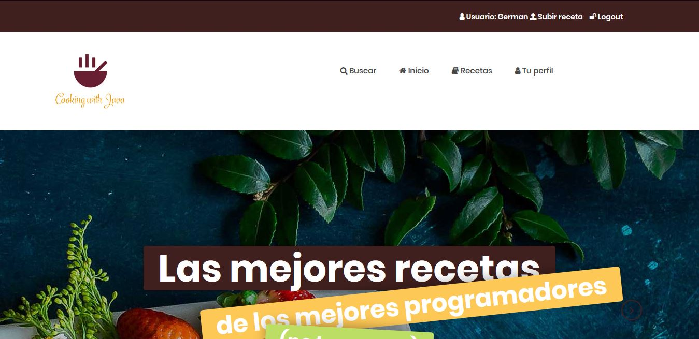

*Figura 2: Primera imagen de la página de inicio con el usuario logeado.*


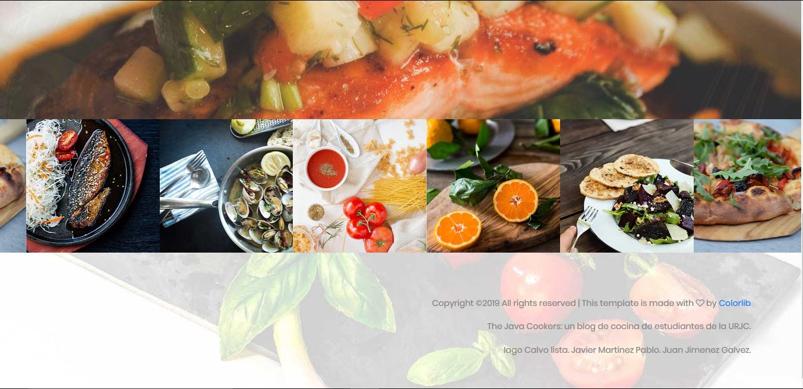

*Figura 3: Segunda imagen de la página de inicio.*

* Está página actuará como inicio de la página web. Aquí, el usuario podrá acceder a las funciones principales tales como subir una nueva receta, logearse y registrarse, acceder a su perfil, ver todas las recetas y buscar recetas concretas.


### Acceso


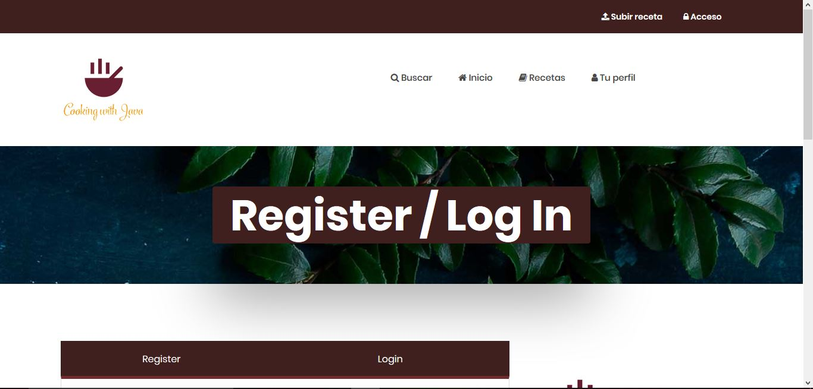

*Figura 4: Primera imagen de la página donde el usuario podrá logearse o registarse.*

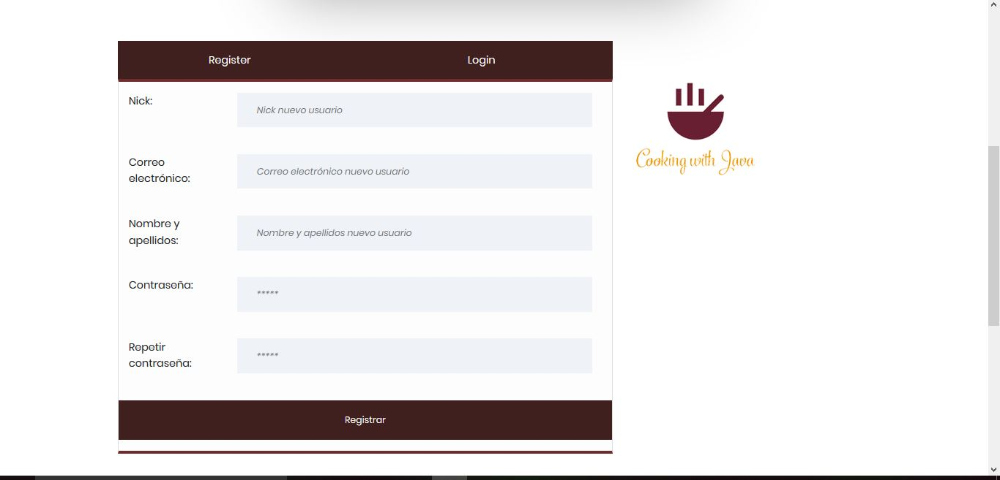

*Figura 5: Segunda imagen de la página donde el usuario podrá logearse o registarse.*

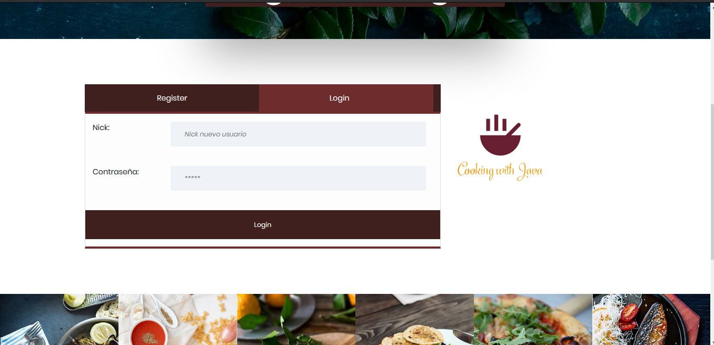

*Figura 6: Tercera imagen de la página donde el usuario podrá logearse o registarse.*

* En esta página el usuario podrá o bien registrarse como nuevo usuario, donde tendrá que rellenar los campos de nombre y apellidos, nickname, correo electrónico y contraseña; o bien logearse directamente si ya tiene cuenta, indicando su nick y su contraseña.


### Subir receta


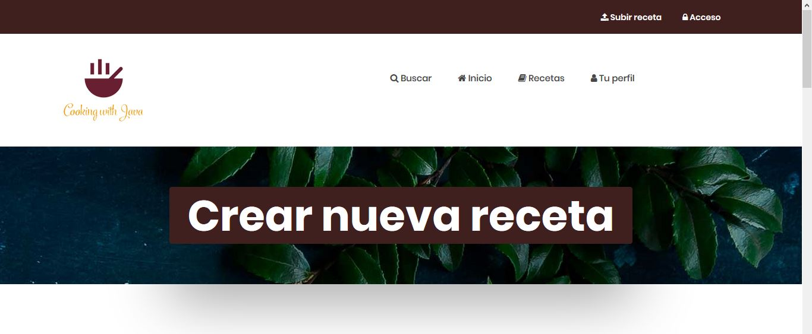

*Figura 7: Primera imagen de la página que el usuario usará para subir recetas nuevas.*

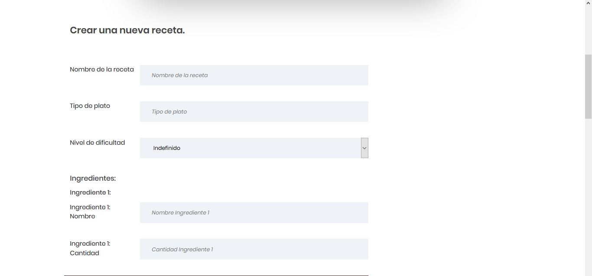

*Figura 8: Segunda imagen de la página que el usuario usará para subir recetas nuevas.*

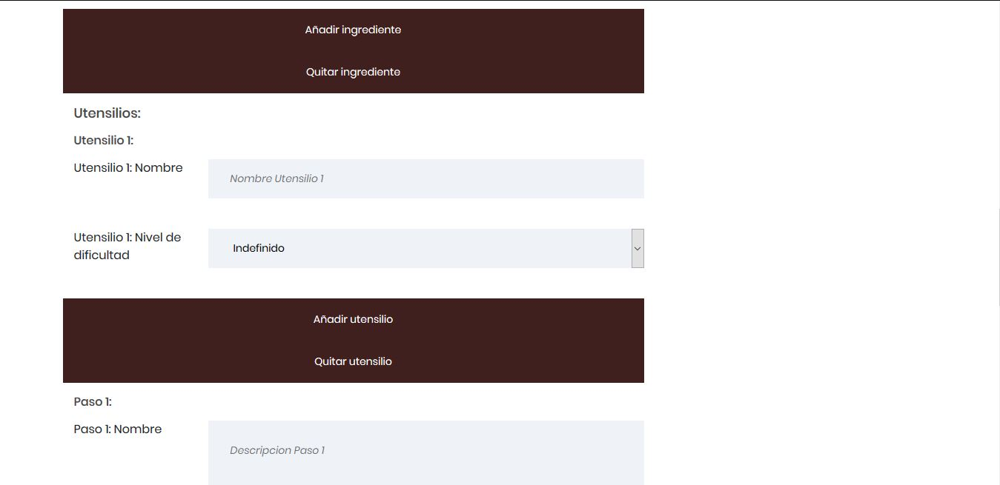

*Figura 9: Tercera imagen de la página que el usuario usará para subir recetas nuevas.*

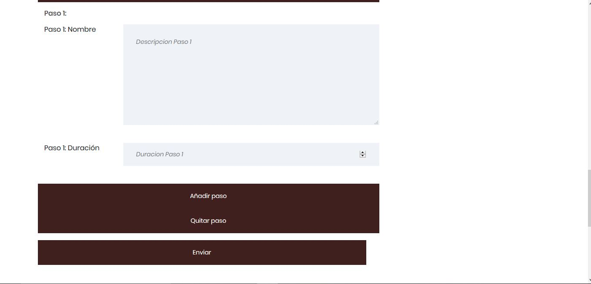

*Figura 10: Cuarta imagen de la página que el usuario usará para subir recetas nuevas.*

* En esta sección de la página, el usuario podrá crear y subir nuevas recetas. Para poder crear nuevas recetas, deberá rellenar una serie de campos en los que se incluyen: nombre de la receta, tipo de plato, nivel de dificultad,los nombres y las cantidades de  los diferentes ingredientes, los utensilios que se van a usar y los pasos a seguir para crear la receta.


### Buscar recetas

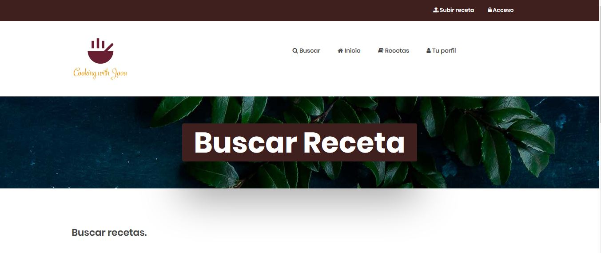

*Figura 11: Primera imagen del buscador de recetas.*

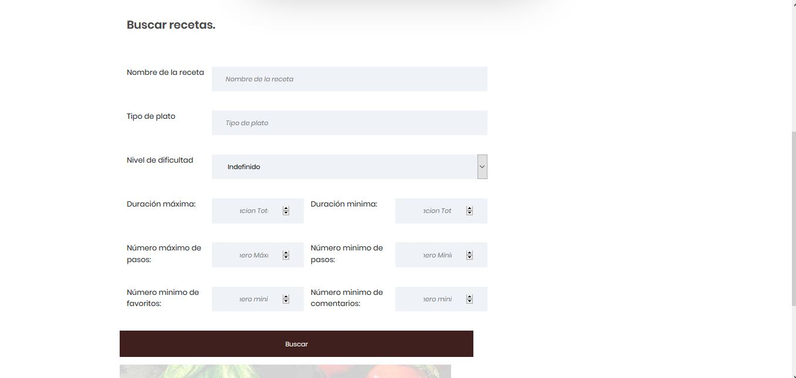

*Figura 12: Segunda imagen del buscador de recetas.*

* En esta página, el usuario podrá buscar recetas en función del nombre de la receta, el tipo de plato, el nivel de dificultad, el número de pasos, la duración y el número de comentarios o de favoritos que tiene.


### Recetas

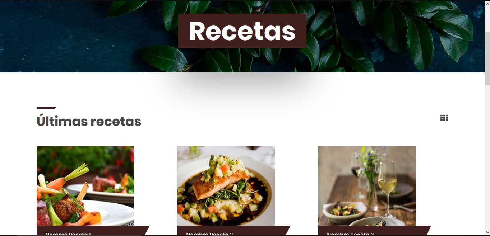

*Figura 13: Imagen de la página donde se muestran todas las recetas.*

* En esta parte de la web se mostrarán todas las recetas subidas de todos los usuarios.

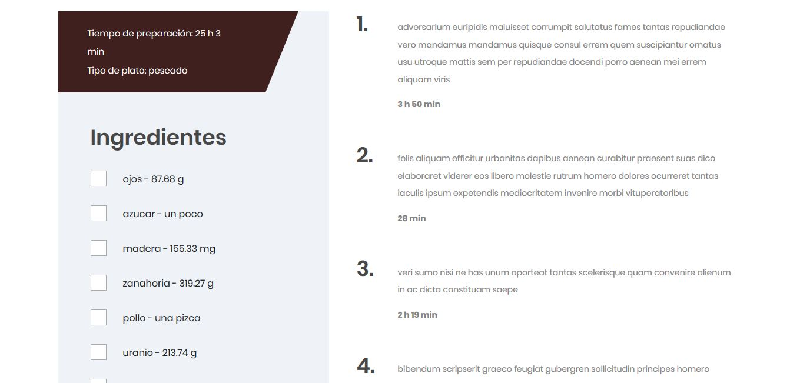

*Figura 14: Ejemplo de receta.*


### Perfil

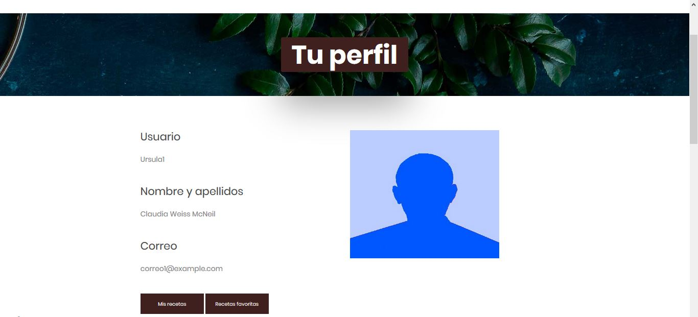

*Figura 15: Página del perfil del usuario.*

* Aquí se mostrará la información del usuario y dos links a sus recetas y su recetas favoritas.


### Diagrama de navegación de las principales páginas.
A continuación, se muestra un diagrama simplificado de la navegación en la web.


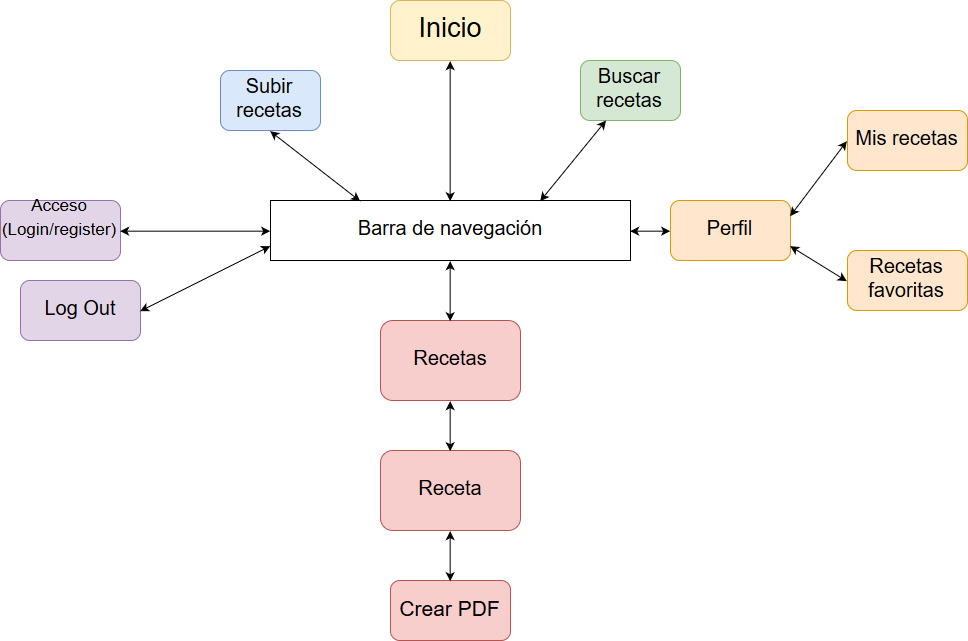

*Figura 16: Diagrama de navegación.*

Se ha decidido usar este esquema más simplificado porque en la aplicación que se ha desarrollado, se puede acceder a cualquier página desde la página en la que esté el usuario y, por lo tanto, daría como resultado un diagrama de navegación casi ilegible, pues habría que unir cada página con el resto. Como resultado, se ha optado por definir este esquema en el que se explica que desde la barra de navegación, presente en todas las páginas, puedes acceder al resto.


### Modelo de datos de la aplicación
#### Diagrama de clases UML
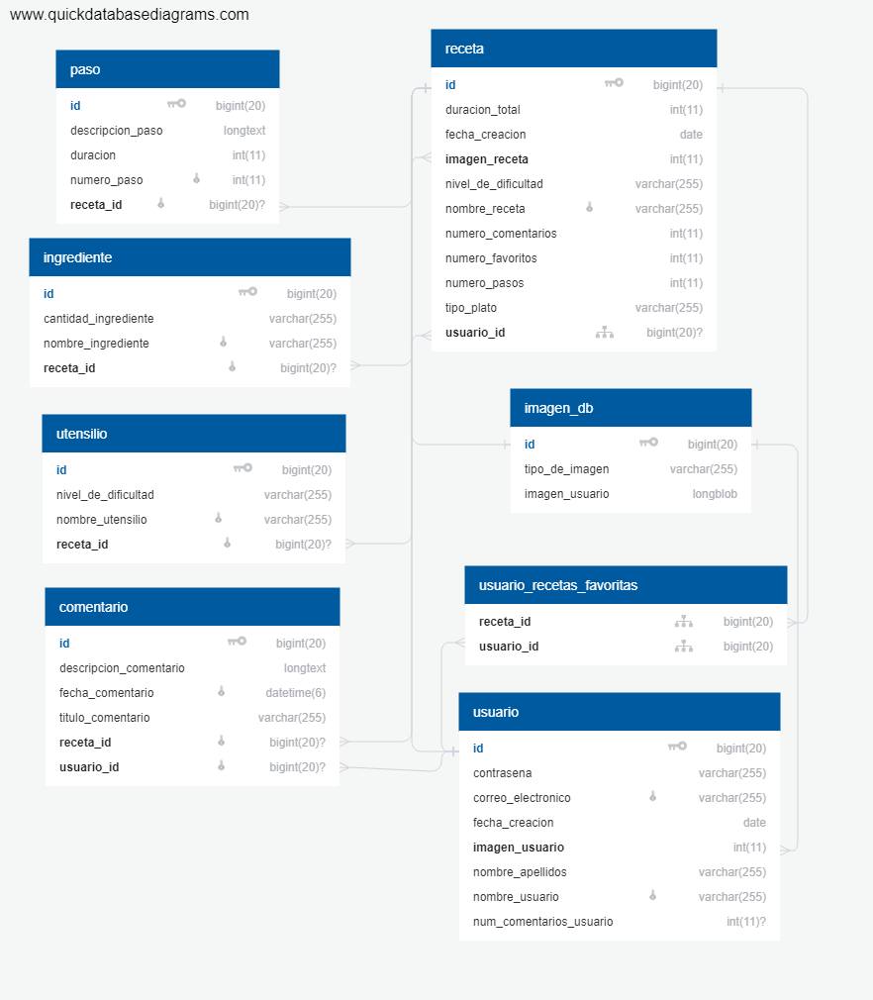
*Figura 17: Diagrama de clases UML.*


#### Diagrama Entidad/Relación que muestre cómo se persisten dichos datos en la base de datos relacional
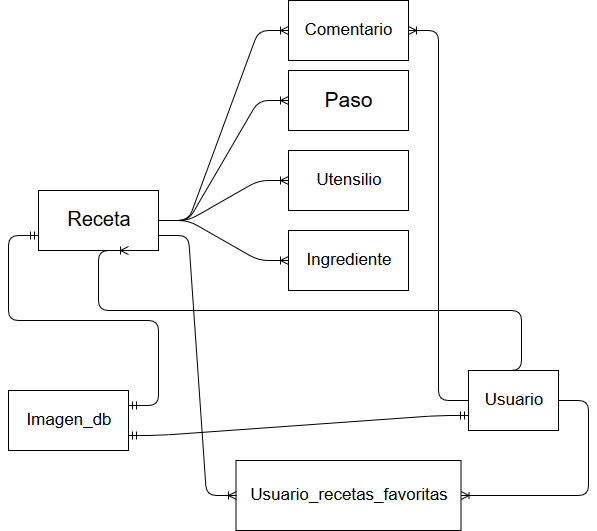
*Figura 18: Diagrama entidad/relación.*

## FASE 3 - Inclusión de seguridad y servicio interno
### Interfaz de comunicación escogida
Como método de comunicación con el servicio interno se  ha usado Api-rest, ya que facilitará la implementación del balanceo en la siguiente fase. La aplicación principal envia al servicio interno los datos de la receta que desea convertir en PDF por medio de un archivo JSON, el servicio interno procesa esa información y devuelve un array de bytes que bien corresponde al archivo PDF o a un archivo de texto.

Para realizar una petición que nos devuelva un el archivo pdf se usara la URL del servicio interno acompañada de ***/crearPDF***, mientras que para obtener un archivo de texto que resuma la receta se usara la URL acompañada de ***crearTXT***; ambas url recibiran un JSON con los siguientes campos:
* **nombre_receta**: Nombre de la receta.
* **nivel_de_dificultad**: Nivel de dificultad de la receta como una cadena de texto, los valores estandar son *Indefinido*, *Facil*, *Medio*, *Dificil*, *Experto*, *Profesional*.
* **tipo_plato**: Tipo de plato como string: (ej: postre, plato principal, etc.)
* **numero_comentarios**: Número de comentarios en formato de numero entero.
* **numero_favoritos**: Número de favoritos en formato de numero entero.
* **creador**: Contiene la información del creador de la receta en los siguientes campos.
  * **correo_electronico**: Dirreccion de correo electronico del creador de la receta.
  * **nombre_apellidos**: Nombre y apellidos del creador de la receta.
  * **nombre_usuario**: Nombre de usuario o nick del creador de la receta.
* **numero_ingredientes**: Número de ingredientes en formato de numero entero.
* **ingredientes**: Lista con todos los ingredientes que componen la receta.
  * **ingrediente-Núm**: Contiene la información de un ingrediente de la receta con los siguientes campos. Se guarda como una lista ordenada empezando en 1 de la forma: *ingrediente-1*.
    * **nombre_ingrediente**: Nombre del ingrediente.
    * **cantidad_ingrediente**: Cantidad usada del ingrediente en formato texto (Ej: *206.59 mg*).
* **numero_utensilios**: Número de utensilios en formato de numero entero.
* **utensilios**:  Lista con todos los utensilios que componen la receta.
  * **utensilio-Núm**: Contiene la información de un utensilio de la receta con los siguientes campos. Se guarda como una lista ordenada empezando en 1 de la forma: *utensilio-1*.
    * **nombre_utensilio**: Nombre del utensilio.
    * **nivel_de_dificultad**: Nivel de dificultad necesario para usar el utensilio.
* **numero_pasos**: Número de pasos en formato de numero entero.
* **duracion_total**: Duración total necesaria para realizar la receta en formato texto (Ej: 3 h 48 min).
* **pasos**: Lista con todos los pasos que componen la receta.
  * **paso-Núm**: Contiene la información de un paso de la receta con los siguientes campos. Se guarda como una lista ordenada empezando en 1 de la forma: *paso-1*.
    * **descripcion**: Descripción del paso.
    * **duracion**: Duración necesaria para realizar el paso en formato texto.

Para facilitar su fúturo uso a continuación se muestra un ejemplo del json enviado a una petición, notese que aunque se genera un JSON completo de la receta cuando se crea un PDF muchos campos son obviados.
```
{
  "nombre_receta": "Nombre Receta",
  "nivel_de_dificultad": "Medio",
  "tipo_plato": "postre",
  "numero_comentarios": 2,
  "numero_favoritos": 1,
  "creador": {
    "correo_electronico": "correo@example.com",
    "nombre_apellidos": "Nombre Apellido1 Apellido2",
    "nombre_usuario": "NickUsuario"
  },
  "numero_ingredientes": 2,
  "ingredientes": {
    "ingrediente-1": {
      "nombre_ingrediente": "uranio",
      "cantidad_ingrediente": "206.59 mg"
    },
    "ingrediente-2": {
      "nombre_ingrediente": "patatas",
      "cantidad_ingrediente": "medio vaso"
    }
  },
  "numero_utensilios": 2,
  "utensilios": {
    "utensilio-1": {
      "nombre_utensilio": "cuchillo",
      "nivel_de_dificultad": "MEDIO"
    },
    "utensilio-2": {
      "nombre_utensilio": "olla",
      "nivel_de_dificultad": "DIFICIL"
    }
  },
  "numero_pasos": 2,
  "duracion_total": "3 h 48 min",
  "pasos": {
    "paso-1": {
      "descripcion": "texto de ejemplo pharetra tation utamur suscipit idque posidonium",
      "duracion": "25 min"
    },
    "paso-2": {
      "descripcion": "lorem ipsum porta dicunt populo ne verear non convallis iriure netus his vocibus",
      "duracion": "3 h 23 min"
    }
  }
}
```
### Diagrama de clases de la aplicación
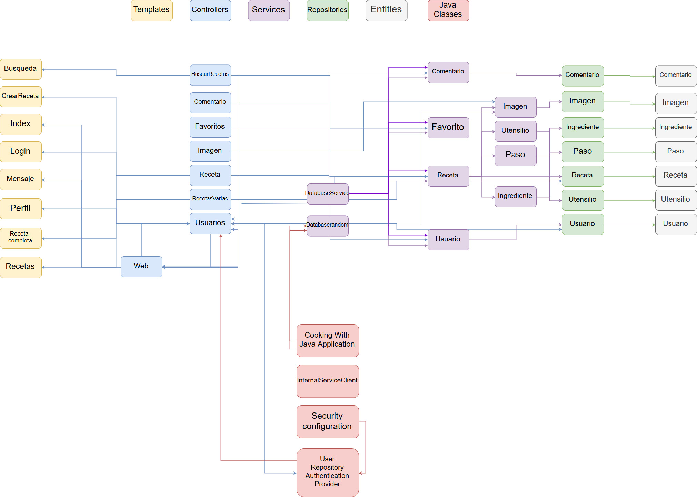

*Figura 19: Diagrama de clases de la aplicación.*

### Instrucciones de despliegue
#### Instrucciones de despliegue windows
Es necesario java-jre versión 9 o superior para ello se puede usar el gestor de paquetes [chocolatey](https://chocolatey.org/). Una vez instalado chocolatey se puede simplemente instalar con ejecutar como administrador:

```
choco install server-jre9 -y
```
A continuación se procedará a instalar mysql 8.0.15; siguiendo con cholatey:
```
choco install mysql --version 8.0.15 -y
```

Despues se debe abrir una consola mysql con permisos necesarios, para ello en windows se puede ejecutar para que pregunte la contraseña del administrador de la base de datos (nula por defecta):
```
mysql -u root -p
```
A continuacion se debe configuar la base de datos y otorgar permiso al usuario por defecto.
```
create database db_cooking_with_java; -- Crea la base de datos
create user 'cookingWithJavaDefaultUser'@'%' identified by 'cookingWithJavaDefaultPass'; -- Crea el usaurio por defecto
grant all on db_cooking_with_java.* to 'cookingWithJavaDefaultUser'@'%'; --Otorga privilegios al usuario sobre la base de datos
```
Finalmente la aplicación puede ser ejecutada con 
```
java -jar ruta/del/archivo
```
#### Intrucciones de despliegue en ubuntu 18.04 server
Lo primero que se hará es configurar ssh para permitir control remoto de la máquina, para ello intale los paquetes necesarios:
```
sudo apt intall nano openssh-server -y
```
A continuacion se debe editar el archivo /etc/ssh/sshd_config para cambiar la linea *#Port 22* a *Port 1337*. Para ello ejecute:
```
sudo nano /etc/ssh/sshd_config
```
Cambie la linea y presione *ctrl+x*, a continuación presion *Y* y finalmente *enter*. A continuación ya podremos conectarnos desde nuestra máquina local una vez reiniciemos ssh.
```
sudo ufw allow 1337
sudo service ssh restart
```
En caso de usar virtualbox se deberá poner como tipo de conexión y hacer un reenvio de puertos del 1337 al 1337.
```
ssh username@ip -p1337
```
En caso de que nuestro usuario sea thejavacookers y estemos usando la ip predefinida de virtual box:
```
ssh thejavacookers@127.0.0.1 -p1337
```
Empezamos installando java 9 o superior.
```
sudo add-apt-repository ppa:webupd8team/java -y
sudo apt update
sudo apt install default-jre -y
```
Continuamos intallando mysql:
```
sudo apt install mysql-server -y
```
Abrimos una consola mysql y creamos la base de datos y damos permiso a la aplicion para modificarla con:
```
sudo mysql
create database db_cooking_with_java; 
create user 'cookingWithJavaDefaultUser'@'%' identified by 'cookingWithJavaDefaultPass'; 
grant all on db_cooking_with_java.* to 'cookingWithJavaDefaultUser'@'%';
exit;
```
Finalmente envaimos el jar ejecutando en el remoto:
```
scp -P 1337 ruta/local/archivo.jar nombreUsuario@ip:/ruta/destino
```
Supondremos que lo guardaremos en home y que abrimos una consola en la carpeta del jar:
```
scp -P 1337 ./CookingWithJava.jar thejavacookers@127.0.0.1:/home/thejavacookers
scp -P 1337 ./CookingWithJavaInternalService.jar thejavacookers@127.0.0.1:/home/thejavacookers
```
Finalmente se pueden ejecutar con:
```
java -jar CookingWithJava.jar
java -jar CookingWithJavaInternalService.jar
```
Notose que si se usa virtualbox se debería hacer un reenvío de puertos del 9000 al 9000 (servicio interno) y otro para el 8443 (conexión https).
#### Intrucciones de despliegue en ubuntu 18.04 server usando docker
Primero installamos docker:
```
sudo apt update

sudo apt install apt-transport-https ca-certificates curl software-properties-common -y

curl -fsSL https://download.docker.com/linux/ubuntu/gpg | sudo apt-key add -

sudo add-apt-repository "deb [arch=amd64] https://download.docker.com/linux/ubuntu bionic stable"

sudo apt update

apt-cache policy docker-ce

sudo apt install docker-ce -y
```
Comprobamos que ejecuta con:
```
sudo systemctl status docker
```
Installamos docker compose:
```
sudo curl -L "https://github.com/docker/compose/releases/download/1.23.1/docker-compose-$(uname -s)-$(uname -m)" -o /usr/local/bin/docker-compose

sudo chmod +x /usr/local/bin/docker-compose
```

Enviamos la carpeta build a la maquina virtual, por ejemplo:

```
scp -P1337 -r ./build thejavacookers@127.0.0.1:/home/thejavacookers 
```
Realizamos docker compose en la maquina:
```
cd /home/thejavacookers/build

sudo docker-compose up --detach --build  
```

Podemos consultar el estado de la aplicación con:
```
sudo docker container ls --all

sudo docket logs NameOfTheContainer
```
#### Compilación
En caso de no usar los .jar ofrecidos y querer generarlos manulamente basta con ejecutar:
```
./mvnw -Dmaven.test.skip=true package 
```

#### Backup
La base de datos puede ser exportada con:
```
sudo docker exec mysqlMaster /usr/bin/mysqldump -u cookingWithJavaDefaultUser --password=cookingWithJavaDefaultPass db_cooking_with_java > exampleBackup.sql
```
Luego puede ser restaurada con el siguiente comando, se incluye una base de datos con datos de ejemplo en el archivo build/exampleBackup.sql
```
cat exampleBackup.sql | sudo docker exec -i mysqlMaster /usr/bin/mysql -u cookingWithJavaDefaultUser --password=cookingWithJavaDefaultPass db_cooking_with_java
```
## FASE 4 - Incluir tolerancia a fallos en la aplicación

### Diagrama de despliegue en docker
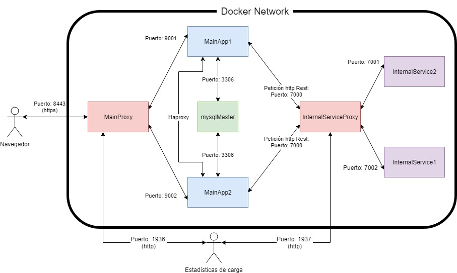

*Figura 19: Diagrama de despliegue en docker de la aplicación.*

### Video de demostración
<!--cambiar el video cambiando VIDIDHERE-->
[](https://www.youtube.com/watch?v=VIDIDHERE)

<https://youtu.be/VIDIDHERE>